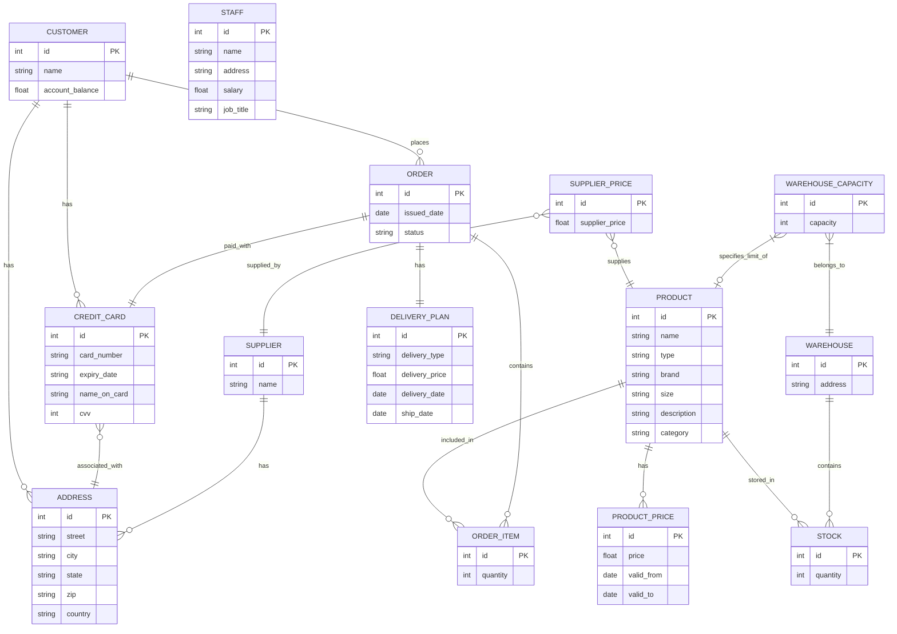

```mermaid
erDiagram
    CUSTOMER ||--o{ ADDRESS : has
    CUSTOMER ||--o{ CREDIT_CARD : has
    CUSTOMER ||--o{ ORDER : places
    CUSTOMER {
        int id PK
        string name
        float account_balance
    }

    ADDRESS {
        int id PK
        string street
        string city
        string state
        string zip
        string country
    }

    STAFF {
        int id PK
        string name
        string address
        float salary
        string job_title
    }

    CREDIT_CARD }o--|| ADDRESS : associated_with
    CREDIT_CARD {
        int id PK
        string card_number
        string expiry_date
        string name_on_card
        int cvv
    }

    PRODUCT ||--o{ PRODUCT_PRICE : has
    PRODUCT ||--o{ STOCK : stored_in
    PRODUCT ||--o{ ORDER_ITEM : included_in
    PRODUCT {
        int id PK
        string name
        string type
        string brand
        string size
        string description
        string category
    }

    PRODUCT_PRICE {
        int id PK
        float price
        date valid_from
        date valid_to
    }

    WAREHOUSE ||--o{ STOCK : contains
    WAREHOUSE {
        int id PK
        string address
    }

    STOCK {
        int id PK
        int quantity
    }

    ORDER ||--o{ ORDER_ITEM : contains
    ORDER ||--|| CREDIT_CARD : paid_with
    ORDER ||--|| DELIVERY_PLAN : has
    ORDER {
        int id PK
        date issued_date
        string status
    }

    ORDER_ITEM {
        int id PK
        int quantity
    }

    DELIVERY_PLAN {
        int id PK
        string delivery_type
        float delivery_price
        date delivery_date
        date ship_date
    }

    SUPPLIER ||--o{ ADDRESS : has
    SUPPLIER {
        int id PK
        string name
    }
    
    SUPPLIER_PRICE }o--|| PRODUCT : supplies
    SUPPLIER_PRICE }o--|| SUPPLIER : supplied_by
    SUPPLIER_PRICE {
        int id PK
        float supplier_price
    }

    WAREHOUSE_CAPACITY }|--o| PRODUCT : specifies_limit_of
    WAREHOUSE_CAPACITY }|--|| WAREHOUSE : belongs_to
    WAREHOUSE_CAPACITY {
        int id PK
        int capacity
    }
```